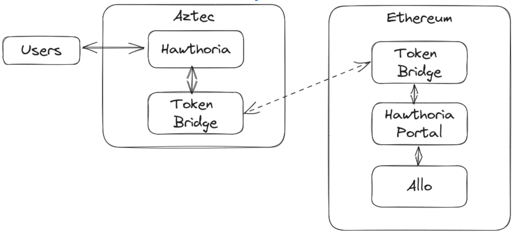

# Haworthia

> **_NOTE:_** implementation has moved to the [aztec monorepo](https://github.com/AztecProtocol/aztec-packages)

Haworthia is an Aztec portal implementation (in noir) that can be used to privately use the Allo Protocol. This initial proof of concept ( not complete ) has a portal for the `fundPool` function, with `allocate` being actively developed.  

### High level arch:

